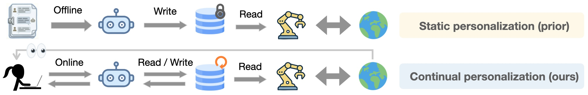

<div align="center">

<h2> Learning Personalized Agents from Human Feedback </h2>

🌐 [Project Page](https://personalized-ai.github.io/) | 📄 [Paper]()

<p>Kaiqu Liang<sup>1,2</sup>, Julia Kruk<sup>1</sup>, Shengyi Qian<sup>1</sup>, Xianjun Yang<sup>1</sup>, Shengjie Bi<sup>1</sup>, Yuanshun Yao<sup>1</sup>, Shaoliang Nie<sup>1</sup>, Mingyang Zhang<sup>1</sup>, Lijuan Liu<sup>1</sup>, Jaime Fernández Fisac<sup>2</sup>, Shuyan Zhou<sup>1,3</sup>, Saghar Hosseini<sup>1</sup></p>

<p><sup>1</sup>Meta Superintelligence Labs, <sup>2</sup>Princeton University, <sup>3</sup>Duke University</p>

</div>



## Overview

The system implements two types of personal agents:
- **Embodied Agent**: For robot assistance tasks in household scenarios
- **Shopping Agent**: For e-commerce product recommendation tasks

Both agents support:
- Memory-based learning (SQL or FAISS backends)
- Pre-action feedback (asking clarifying questions)
- Post-action feedback (learning from corrections)

## Project Structure

```
PAHF/
├── run_agent.py                    # Main entry point
├── agents/                         # Agent implementations
│   ├── base.py                     # BasePersonalAgent class
│   ├── embodied_agent.py           # EmbodiedAgent for robot tasks
│   └── shopping_agent.py           # ShoppingAgent for shopping tasks
├── data/                           # Datasets
│   ├── embodied/                   # Embodied agent data
│   │   ├── personas/               # User persona definitions
│   │   └── scenarios/              # Task scenarios
│   └── shopping/                   # Shopping agent data
├── memory/                         # Memory system
│   ├── banks.py                    # SQLiteMemoryBank, FAISSMemoryBank
│   └── utils.py                    # Memory retrieval utilities
├── prompts/                        # Prompt templates
│   ├── embodied_prompts.py         # Prompts for embodied agent
│   └── shopping_prompts.py         # Prompts for shopping agent
└── utils/                          # Utility functions
    ├── llm.py                      # LLMClient for OpenAI API
    ├── json_utils.py               # JSON read/write utilities
    └── agent_utils.py              # Metrics, memory initialization
```

## Setup

### Prerequisites

- Python 3.8 or higher
- OpenAI API key

### Installation

1. Clone this repository
2. Install dependencies:
```bash
pip install -r requirements.txt
```

3. Set your OpenAI API key:
```bash
export OPENAI_API_KEY='your-api-key-here'
```

Alternatively, you can pass the API key directly when initializing the LLM client in the code.

## Usage

### Running the Embodied Agent

```bash
python run_agent.py --agent embodied
```

### Running the Shopping Agent

```bash
python run_agent.py --agent shopping
```

### Command Line Options

- `--agent`: Choose agent type (`embodied` or `shopping`)
- `--mem_style`: Memory backend (`sql` or `faiss`, default: `sql`)
- `--no-memory`: Run baseline without memory (disables PAHF feedback loop)
- `--learning_iter`: Number of learning iterations for phases 1 and 3 (default: 3)
- `--model`: LLM model to use (default: `gpt-4o`)

### Examples

Run PAHF embodied agent with SQLite memory:
```bash
python run_agent.py --agent embodied
```

Run PAHF embodied agent with FAISS memory:
```bash
python run_agent.py --agent embodied --mem_style faiss
```

Run baseline (no memory) for comparison:
```bash
python run_agent.py --agent embodied --no-memory
```

Run with custom model and learning iterations:
```bash
python run_agent.py --agent embodied --learning_iter 5
```

## Architecture

### Core Components

- `utils/llm.py`: OpenAI API client for LLM generation
- `memory/banks.py`: Memory bank implementations (SQL and FAISS)
- `agents/base.py`: Base class for personal agents
- `agents/embodied_agent.py`: Implementation for robot assistance tasks
- `agents/shopping_agent.py`: Implementation for shopping recommendation tasks
- `run_agent.py`: Entry point for running experiments

### Memory System

The system supports two memory backends:

1. **SQLite**: Stores memories in a relational database with embeddings
   - Good for: Persistent storage, easy inspection
   - Storage: Single database file per experiment

2. **FAISS**: Uses Facebook AI Similarity Search for vector storage
   - Good for: Fast similarity search, large-scale deployments
   - Storage: Index file + metadata file per experiment


## Data Structure

### Embodied Agent

Data files are organized in `data/embodied/`:
- `scenarios/original_scenarios_A.json`: Training scenarios (phase 1)
- `scenarios/original_scenarios_B.json`: Evaluation scenarios (phase 2)
- `scenarios/evolved_scenarios_A.json`: Training with evolved personas (phase 3)
- `scenarios/evolved_scenarios_B.json`: Evaluation with evolved personas (phase 4)
- `personas/original_persona.py`: Original user personas
- `personas/evolved_persona.py`: Evolved user personas

Each scenario in the JSON files has the following structure:
```json
{
  "index": 0,
  "scene": "a black coffee, an herbal tea, a green juice, walnuts",
  "task": "Could you bring me my favourite drink?",
  "context": "General preference",
  "user": "Alex",
  "user_intent_object": "herbal tea",
  "user_intent_location": "pick-up",
  "scene_objects": ["black coffee", "herbal tea", "green juice", "walnuts"]
}
```

### Shopping Agent

Data files are in `data/shopping/`:
- `phase1.json`: Training shopping scenarios
- `phase2.json`: Evaluation shopping scenarios
- `phase3.json`: Training with updated preferences
- `phase4.json`: Evaluation with updated preferences
- `original_persona.json`: Original user personas
- `updated_persona.json`: Updated user personas
- `persona_info.json`: Detailed preference information

**Note on Shopping Performance**: The shopping agent in this release may perform better than the version reported in the paper due to minor prompt and feedback-logic refinements.

### Customizing agent behavior

Prompts are defined in the `prompts/` directory:
- `prompts/embodied_prompts.py`: Prompts for embodied agent
- `prompts/shopping_prompts.py`: Prompts for shopping agent

You can customize these prompts to change agent behavior.


### Customizing Human Personas (Simulator)

You can customize the human persona (simulator) that provides feedback to the agent. The persona definitions are located in:
- `data/embodied/personas/original_persona.py`: Embodied agent personas
- `data/embodied/personas/evolved_persona.py`: Evolved embodied personas
- `data/shopping/original_persona.json`: Shopping agent personas
- `data/shopping/updated_persona.json`: Updated shopping personas

Each persona defines user preferences that the simulated human uses when providing feedback. You can modify these to test different user behaviors or create entirely new personas.

**Future Research Direction**: The human simulator is currently using predefined personas. An interesting research direction is to develop more sophisticated human simulators that can:
- Model diverse user communication styles
- Simulate realistic user patience and feedback quality
- Adapt feedback based on agent performance history
- Generate more naturalistic preference expressions

### Adding New Memory Backends

To add a new memory backend, implement the `MemoryBank` abstract class in `memory/banks.py` with these methods:
- `add(text)`: Add a new memory
- `search(query, top_k)`: Search for similar memories
- `find_similar_memory(text, threshold)`: Find most similar memory above threshold
- `update_memory(memory_id, new_text)`: Update existing memory
- `get_memory(memory_id)`: Get memory by ID
- `get_all_memories()`: Get all memories
- `close()`: Cleanup resources

## Citation

If you use this code in your research, please cite:

```
[TO BE ADDED]
```

## License

[License information to be added]

## Notes

- This public version focuses on GPT models
- The codebase has been simplified for public release

